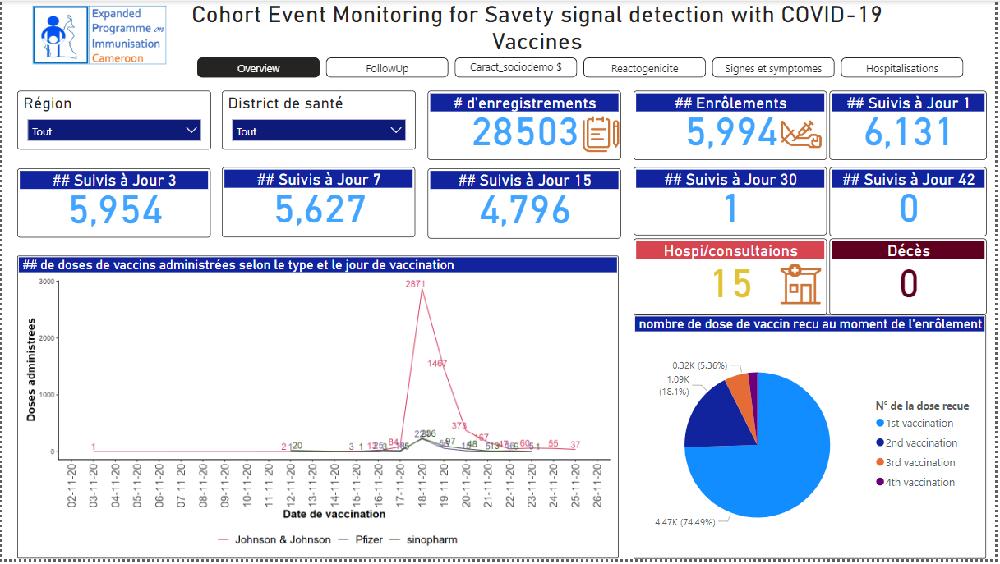
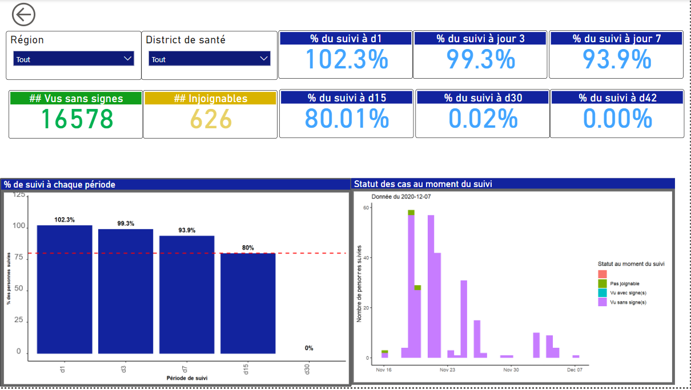
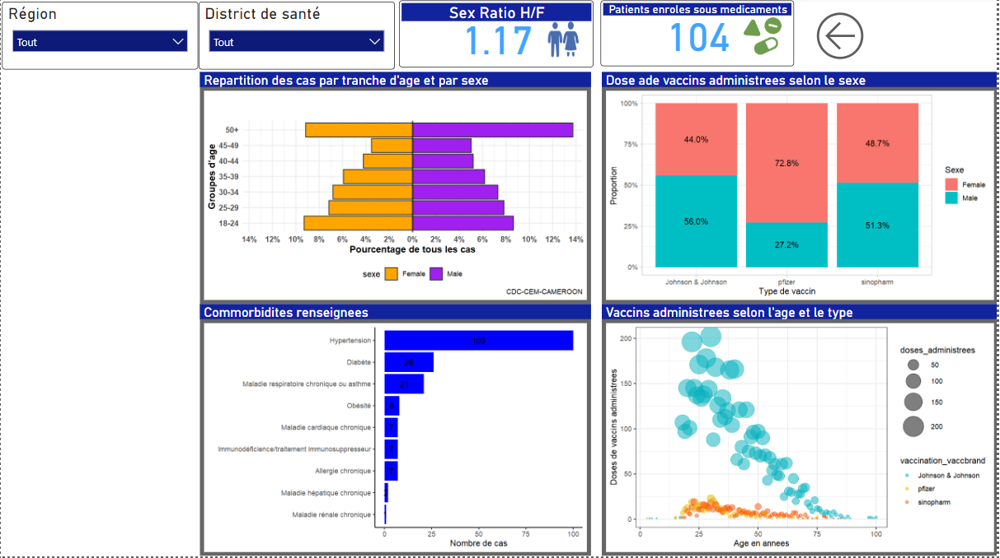

# Script pour générer la situation journalière de suivi des personnes vaccinées contre la COVID-19 dans le cadre de l'enquête CEM ainsi que le Dashboard de performance de suivi

Le script de ce répertoire présente la procédure de traitement des données de l'enquête après extraction dans le formulaire KoboCollect. Une fois téléchargées, les données sont analysées afin de ressortir les personnes enrôlées pour une journée spécifique, les personnes suivies, les personnes dont le suivi n'a pas été effectué et les personnes à suivre les jours à venir pendant la période de l'étude. Les fichiers de sortie étaient sous format Excel, et un masque Excel préconçu permettait de présenter la situation de suivi au cas par cas de chacun des participants (les fichiers a intégrer dans le masque étaient ceux générés par le script). En plus un Dashboard Power Bi a été conçu afin de présenter synthétiquement les performances de suivi par régions.

## Overview

Cette feuille présente la situation générale de suivi, notamment: 
\- Le nombre d'enregistrements pour une régions/district et une journée spécifique 

\- La situation de suivi pour cette journée spécifique 

\- Les doses de vaccin administrées par type de vaccin - Le nombre d'hospitalisation(s) et/ou de décès.

## Situation journaliere du suivi

Cette feuille présente la situation à jour de suivi des personnes vaccines. Notamment:

\- La proportion de suivi a J1,J3,J7,J15,J30 et J42 apres la vaccination contre la Covid19

\- Les patients vus avec ou sans signes

\- Le statut des cas a chaque période de suivi

## Caractéristiques socio démographiques des personnes suivies:

Cette  feuille présente les participants enrôlés par tranche d' âge, les doses  de vaccins administrées  par sexe, les cas avec comorbidités et ainsi que les vaccins administrés selon l’âge et le type

## Signes et symptomes

Cette  feuille  présente les signes  et  symptomes notifiés  par les participants au moment  du suivi par les Enquêteurs.

![feuille]4(images/Capture4.PNG)

